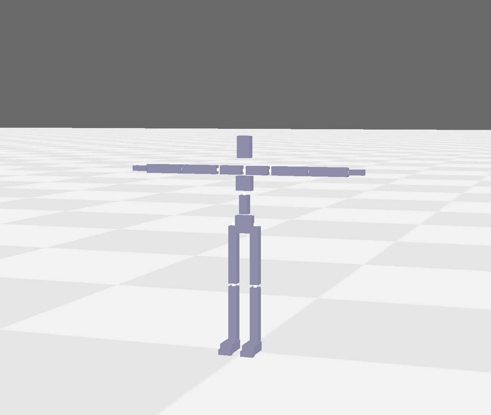
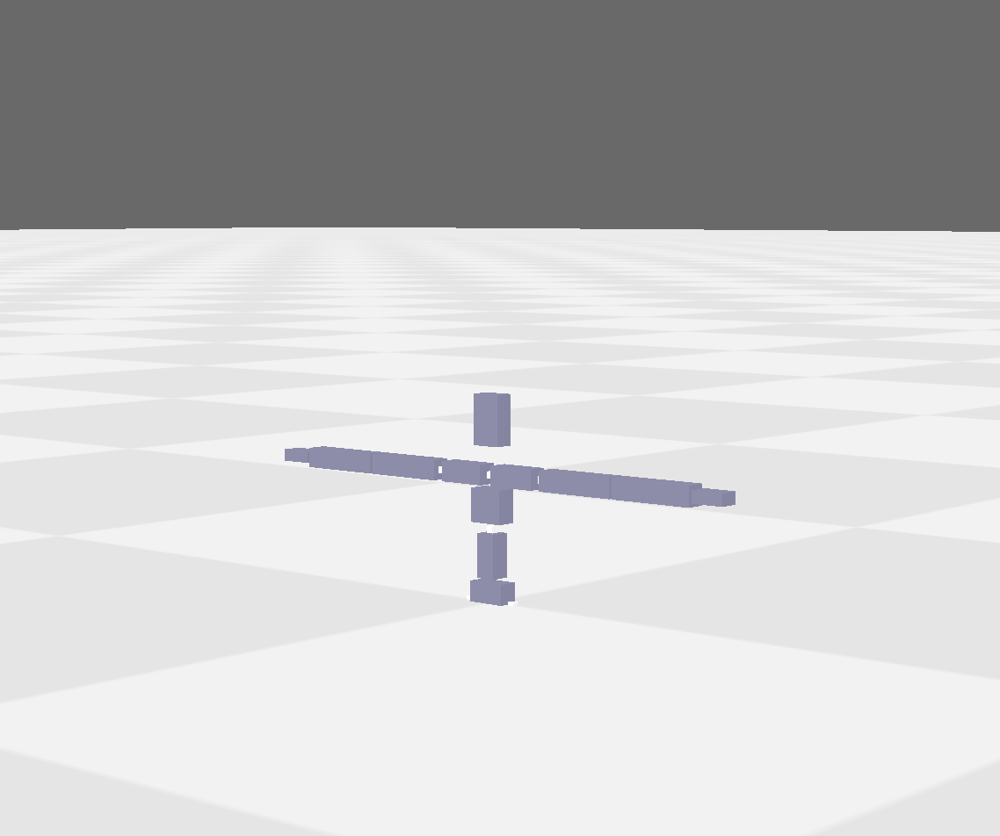
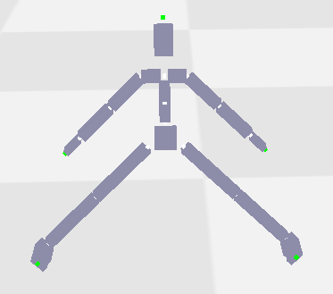
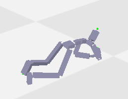
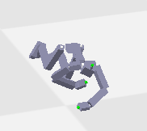
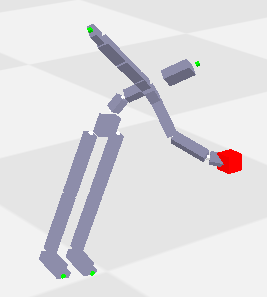
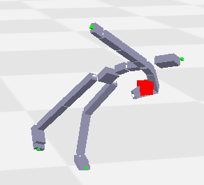
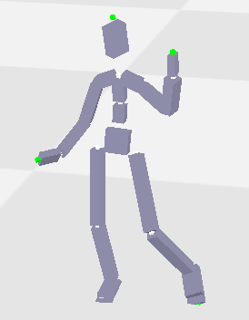
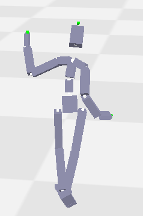

# 作业1

作业代码改编自 https://github.com/GAMES-105/GAMES-105/tree/main/lab1

## 任务零  环境配置 （不赋分）


在这部分中，你需要完成环境安装，并且熟悉Scipy-Rotation中的欧拉角顺序以及Scipy-Rotation中对于一系列角度的向量化批处理。此任务不需要写代码，只需要在`task0_test_environment.py`进行测试。


### Part 0: 安装panda3d(Windows/Linux/Mac)

建议使用conda等建立新的虚拟环境
```bash
conda create -n games105 python=3.8
conda activate games105
conda install numpy scipy
pip install panda3d
```
如果下载过慢可使用清华镜像源安装 ( https://mirrors.tuna.tsinghua.edu.cn/help/anaconda/ )

> 本作业只允许使用 `numpy`， `scipy`，`pytorch(tensor-flow, jitter)`以及其依赖的库。评测时也以此为准。作业文件中请不要import除此之外的库。

完成后可以运行`task0_test_environment.py`，请在main函数内取消part0部分的注释，以显示part0的结果。你将会看到一个T-pose的人形角色。可以通过鼠标左右中键操作相机视角。


<div align="center">
 
</div>

###  一些角色动画领域的术语和Scipy-Rotation库简介

#### 术语

* Body/Link: 角色的身体的某一部分，是一个空间中实际呈现的物体。比如说，UpperLeg表示角色膝盖往上的大腿部分。
* Joint: 关节，是连接两个Body的枢纽。作为约束使得两个Body不分开。比如说，Elbow连接角色的大臂和小臂，叫做肘关节。
* 树形结构: 由于角色是每两个相邻的Body之间被Joint约束，每两个Joint之间又会夹着一个Body。可以发现角色有着树形的拓扑结构。于是可以定义Parent-Body、Parent-Joint。
* RootBody: 在角色动画领域，常常把Pelvis(骨盆)作为最原始的Body，其他的一些Body如LowerBack(脊椎下部)、LeftUpperLeg、RightUpperLeg作为其Child-Body。
* RootJoint: 为了方便常常在RootBody的中心位置虚拟一个Joint，作为最原始的Joint。这样的结果是使得Joint数目和Body的数目相等。
* Pose: 姿态。由于Body和Joint互相约束，所以描述角色“姿态如何”可以用Body也可以用Joint。通常，用表示空间取向(Orientation)和空间位置(Position)来描述。也就是Pose = Orientation $\cup$ Position。
* BVH文件: 一种常见的描述角色Pose的数据格式。由于BVH文件不含有Body的信息，里面的信息只会描述Joint的Pose。详细的介绍旋转及BVH结构的网页请参考 https://zhuanlan.zhihu.com/p/539522515
* Local/Global: 实际上，由于角色有着树形结构，采用一个Joint在其Parent-Joint的坐标系的相对旋转也可以描述空间取向。可见，Orientation是Global表述，其对应的Local表述叫Rotation，特指在Parent-Joint坐标系下的相对旋转。Position也是Global表述，对应的Local表述叫Translation或者Offset。不难推导，如果我们知道从RootJoint到某一个子孙Joint（记为$Joint_{i}$）的一条路径上所有的Rotation。那么$Orientation_i=Rotation_0\cdot Rotation_1 ... \cdot Rotation_i$。(请自行推导Position和Translation的关系:-)
 
#### Scipy的Rotaion库
```python
from scipy.spatial.transform import Rotation as R
```
四元数、旋转矢量、欧拉角、旋转矩阵从Python-List或者Numpy-Ndarray读入，值得注意的是`scipy`的`from_euler`需要提供欧拉角顺序。欧拉角顺序中`xyz`大小写代表不同的旋转方式。
```python
quat = R.from_quat([ 0.        ,  0.80976237,  0.53984158, -0.22990426])
rot_vec = R.from_rotvec([0, 3, 2])
euler_angle = R.from_euler('XYZ', [-109.60643629,  -21.85973481, -164.48716608], degrees=True)
matrix = R.from_matrix([[-0.89428806,  0.24822376, -0.37233564],
       [-0.24822376,  0.41714214,  0.8742868 ],
       [ 0.37233564,  0.8742868 , -0.31143019]])
```

在不引起歧义的时候，可以使用`R(·)`读入
```python
quat = R([ 0.        ,  0.80976237,  0.53984158, -0.22990426])
```
打印输出/互相转化
```python
quat = R.from_rotvec([0, 3, 2]).as_quat()
euler_angle = R.from_matrix([[-0.89428806,  0.24822376, -0.37233564],
       [-0.24822376,  0.41714214,  0.8742868 ],
       [ 0.37233564,  0.8742868 , -0.31143019]]).as_euler('XYZ', degrees=True)
matrix = R.from_quat([ 0.        ,  0.80976237,  0.53984158, -0.22990426]).as_matrix()
```
其他较为细节的参数指定和复杂用法请阅读 https://docs.scipy.org/doc/scipy/reference/generated/scipy.spatial.transform.Rotation.html

如果通过`R.from_rotvec()`,`R.from_quat()`,`R.from_euler()`,`R.from_rotvec()`来将“广义旋转”读入后，可以用`*`进行旋转算符操作，有以下关系：
```python
a = R.from_rotvec([0, 3, 2])
b = R.from_rotvec([2, 1, 5])
c = R.from_rotvec([4, 7, 3])
ans1 = (a * b * c).as_matrix()
ans2 = a.as_matrix() @ b.as_matrix() @ c.as_matrix()
```
在误差允许范围内，`ans1==ans2`

### Part1：体会欧拉角顺序
Scipy-Rotation的`from_euler`里`xyz`大小写代表不同的旋转方式，本次作业里你需要一律使用大写的`XYZ`。我们现在给出一个例子，来体现欧拉角两种旋转方式其实对应不同的四元数（对应不同的旋转）。

在这个部分可以通过取消'XYZ', 'xyz', 'ZYX', 'zyx'部分的注释，来欧拉角转换成四元数的区别。

### Part2：体会Scipy-Rotation向量化计算效率
众所周知，Python的for循环效率远没有Cpp等语言的高，所以尽可能不要写循环次数较大的for循环。对于Numpy等一系列科学计算库，底层实现语言多为Cpp等语言，for循环效率较高。所以当使用vectorized的格式去计算时，效率较高。在这个部分，取消对应的注释，可以体会循环1000次的对于全身所有关节共同作用一个四元数乘法的时间效率。


## 任务一 前向运动学 （60 分）
在这部分中，你需要实现前向运动学函数。

本部分的运行代码在`task1_forward_kinematics.py`，你需要完成的代码在`Lab1_FK_answers.py`。测评时我们将单独拿出`Lab1_FK_answers.py`，你可以对其进行任何必要修改，但请保持接口不变。

在`task1_forward_kinematics.py`的main()函数中，我们定义了一系列测试任务，你需要根据顺序完成需要的函数(在`Lab1_FK_answers.py`中完成)。

在每个部分你需要取消注释对应的测试代码，如
```
part1(viewer, bvh_file_path)
```

### Part 1: 读入BVH文件的人体结构 （20 分）

在这一部分，你需要完成`part1_calculate_T_pose`函数。它输入一个bvh文件路径，返回包括关节的名字, 父关节的索引, 所有关节的偏移量。

提示: 由于虚拟角色是一个树形结构, 可以通过递归的方式实现, 也可以手动模拟一个栈(Stack)。


> 为了方便起见，假设BVH文件的Channels无论Translation还是Rotation均按XYZ顺序排列，在用scipy读取时，可以用`R.from_euler('XYZ', [-109.60643629,  -21.85973481, -164.48716608], degrees=True)`类似的格式

> 默认Channel设置是RootJoint节点有6个channel(平移和旋转)，其余子节点有3个，可以参考`data/dance.bvh`

在实现后，请在`main`函数内取消part1部分的注释，以显示part1的结果，正确读入后, 人会保持T-pose站立(由于腰部在原点，所以会有下半身在地下，可以转动相机看到)。

<div align="center">
 
</div>

### Part 2: 前向运动学计算 （20 分）

在这一部分，你需要完成`part2_one_pose`函数。读入BVH文件中每一帧的动作数据, 计算每个关节在世界坐标系下的旋转和位置。

> 虚拟角色是一个树形结构, 应该从Root结点开始, 向下遍历计算每个关节的旋转和位置。这里需要注意, BVH上面的channel和下面每一行的数据是对应的。我们需要考虑每个关节的欧拉角顺序。以及, 注意在BVH文件里, 是角度[-180, 180], 不是弧度。 

`load_motion_data`辅助函数会为你读出bvh内所写的动作内容。这部分里我们为你调用并将返回的数据当作了函数的输入，之后你也可能会用到它。

在`task1_forward_kinematics.py`，需要写出在使用给出的`load_motion_data`辅助函数读出的Local的Joint Translation和Rotation数据之后，计算Global的Joint Position和Orientation。请在`task1_forward_kinematics.py`中的`part2_forward_kinematics`函数内完成这一任务。
> 需要注意的是我们提供的设置Joint四元数的顺序为(x, y, z, w)，请符合这一顺序，否则渲染结果错误

当任务完成后，请在`main`函数内取消part2部分的注释，其中`part2_one_pose`为选取某一帧来显示的角色姿态，`part2_animation`为完整播放BVH动画，效果是虚拟角色跳舞的动作。


### Part 3:运动重定向 （20 分）

读入一个A-Pose的文件, 将A-pose的bvh重定向到T-pose上
> A-Pose是指角色的初始姿态为肩膀下垂，腿部略微张开(作业中为了方便同学们debug我们将A-pose两腿角度打开得稍大亿点)。和T-Pose的差别是Arm和UpLeg Body的局部旋转不同。如下图：

<div align="center">
 
</div>

我们希望你将其转变成一个以T-pose为初始姿态的bvh。故而我们调用你在part1所写的函数读取了一个T-pose的表示。希望你完成`part3_retarget_func`函数，返回一个`motion_data`。我们会将T-pose和你返回的`motion_data`输入到你在part2所写的函数中，希望获取正确的运动结果。

> 我们这里采用的A-Pose是在Local-Rotation上将lShoulder用欧拉角XYZ的格式旋转[0, 0, -45]度，将rShoulder用欧拉角XYZ的格式旋转[0, 0, 45]度。然后将lHip用欧拉角XYZ的格式旋转[0, 0, 45]度，将rHip用欧拉角XYZ的格式旋转[0, 0, -45]度。虽然有了两个bvh的你应该不需要这个信息，但是它会帮你极大简化工作量。

当任务完成后，请在`main`函数内取消part3部分的注释，会得到重定向后的运动动画，是一个虚拟角色在地上爬行的动作。

<div align="center">
 
 
</div>


如果你实现的效果出现双手/双脚交叉，或者body没有通过关节连接，请检查你的重定向部分。


## 任务二 逆向运动学 （40 分）

在这部分中，你需要实现一个简化的逆向运动学函数。你可以选择任何你喜欢的IK实现方式，比如CCD, Jacobian-based等。各个任务中，IK精度要求都为误差距离`0.01`以内即可(如果能到达目标位置的话)。为了保证帧率，建议限制最大迭代次数。

本部分的运行代码在`task2_inverse_kinematics.py`，你需要完成的代码在`Lab2_IK_answers.py`。测评时我们将单独拿出`Lab2_IK_answers.py`，你可以对其进行任何必要修改，但请保持接口不变。

### Part 1: 静态逆向运动学 （20 分）

假设角色处于静止状态，起始为T-pose，你需要在此基础上调整姿态，保持根节点固定在原地不动，让其端节点够到给定位置。

> 此过程相当于在操作一个从固定点开始，到端节点为止的机械臂。而你需要获取这些可操控关节的索引。不过我们已经为你实现了一个获取可操控路径的函数，请你仔细阅读`MetaData`类，里面记录了你需要的一些固定信息，并提供了一个获取路径的函数。

本部分需要你完成的函数为part1_inverse_kinematics，在这个函数中你需要计算能使左手末端到达给定位置的角色关节位置和旋转，具体的输入输出要求可以看代码中的注释。

为了测试你实现的逆向运动学算法，我们设计了三个小问题，难度逐渐提高。在part1_simple中，我们将根节点设在腰部，即保持腰部位置不动，让左手够到输入的指定位置。在part1_hard中，根节点为左脚，最终实现的效果应该与下图相似，角色通过倾斜身体和弯曲手臂使左手够到指定位置。

<div align="center">
 
 
</div>


### Part 2: 逆向运动学+bvh [the "鸡头稳定器"]（20 分）

输入一个bvh，要求角色的其他身体部分在按照bvh动作的同时，左手手腕在水平方向上对根节点保持静止，竖直方向上维持同一个绝对高度，并且左手手掌保持竖直向上（类似举着一杯水不洒的效果）。注意，此bvh双手都有挥舞的动作，我们只调整左手。

在这部分中，你需要实现`part2_inverse_kinematics`函数，该函数的输入中包括左手相对于角色根节点的x方向、z方向目标位置，以及y方向的目标绝对高度，你的实现需要计算出相关关节位置及旋转，使左手保持在目标位置，同时身体其他部分的动作要和bvh一致。

实现完这个函数后，请在`task2_inverse_kinematics.py`的`main`部分中取消调用`part2`函数的注释，运行代码后的效果应该与下面的图片相似。

<div align="center">
 
 
</div>


## 提交

请不要修改`Lab1_FK_answers.py`和`Lab2_IK_answers.py`之外的文件，上交时请交这两个文件，以及一个简单的文档，说明自己实现的过程和展示最后的结果（截图/视频/GIF文件），打包成zip格式。
