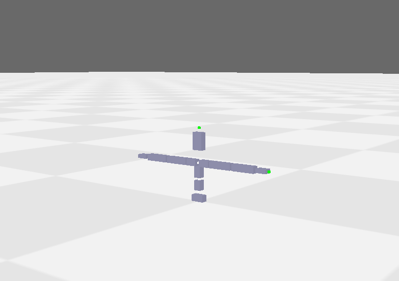
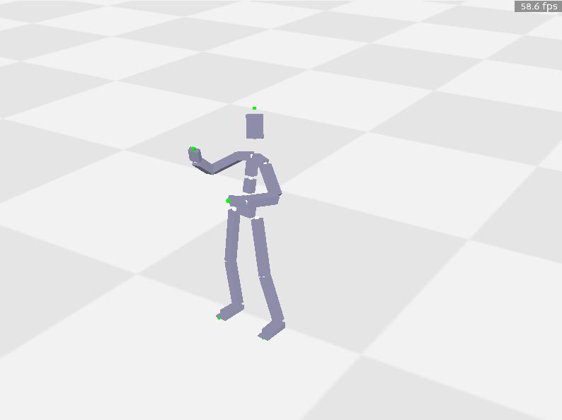
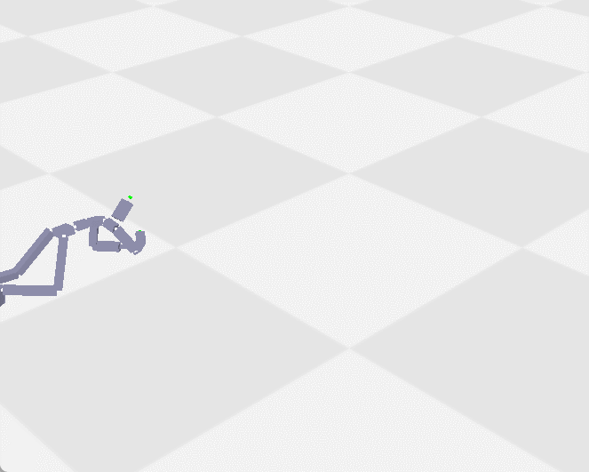
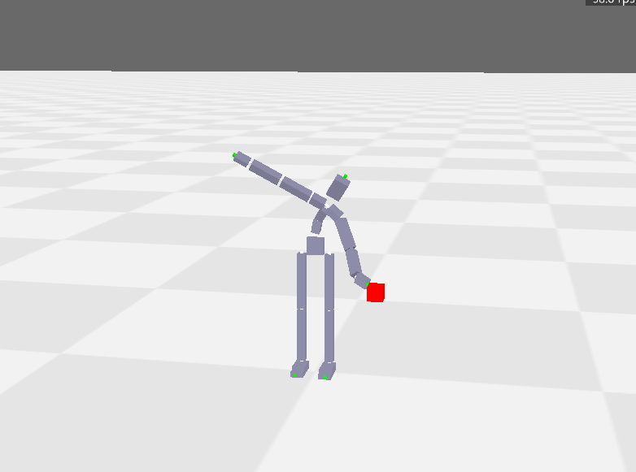
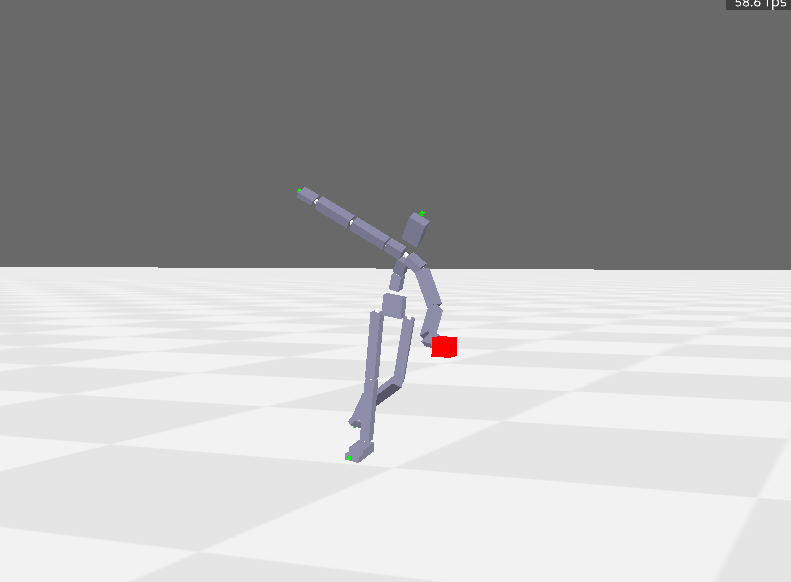
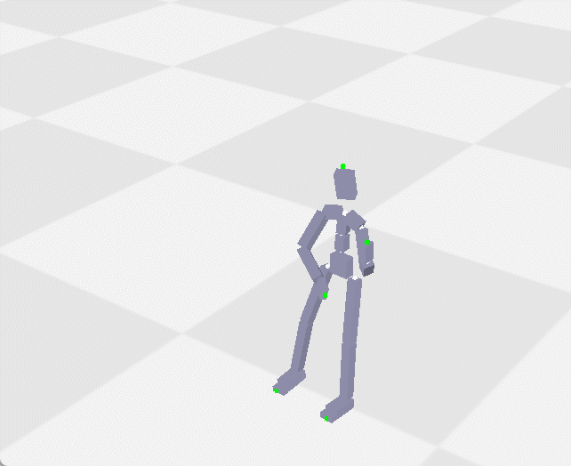

# 作业一报告

## 任务一
### Part 1
使用一个栈结构处理关节的树形关系，一个关节入栈时，栈顶元素就是它的父关节，一个关节的的所有信息读取完毕后，就将其出栈。

运行结果如下：

### Part 2
遍历所有关节，使用公式
$$
    Pos_i = Pos_{p_i} + Ori_{p_i}Offset_i    
$$
以及公式
$$
    Ori_i = Ori_{p_i}R_i    
$$
逐个求出每一个关节的状态。

结果如下：

### Part 3
使用Part 1的函数读取处T-pose和A-pose下的`joint_offset`后，对于每个关节$i$，计算出从T-pose到A-pose下所差的旋转$R_i^{T \rightarrow A}=$`rotation_to_align_vectors(joint_offset_T[i], joint_offset_A[i])`，其中`rotation_to_align_vectors`返回一个旋转，它将第一个参数所代表的向量旋转至与第二个向量重合。

最后，使用公式
$$
    R_i^T = (R_i^{T \rightarrow A})^{-1}R_i^A(R_{child_i}^{T \rightarrow A})
$$
得出T-pose下的`motion_data`，注意在本题中T-pose与A-pose中位置不同的关节均至多只有一个子关节，因此$child_i$有良好定义。

结果如下：

### 任务二

### Part 1
实现CCD算法，循环对路径上每个关节的朝向更新，每次都使得某端点处于该关节与目标点的连线上。注意每次更新关节之后，都需要更新其所有后代关节的位置和朝向。

结果如下：

### Part 2
注意到`lWrist_end`在处于竖直方向时，其与`lWrist`之间的offset近似不变。这是因为在水平方向时，`lWrist_end`在y方向和z方向的偏移接近0（远低于误差要求0.01）。因此，在竖直方向时，`lWrist_end`在x方向和z方向的偏移接近0。根据这个观察，我们只需要优化`lWrist`的位置为`target_position-lWrist_end_offset`即可。只需调用Part 1的方法即可完成这个任务。

结果如下（注意为了保持fps为60，使用了较少的迭代次数，并非所有帧都已经完全收敛）：

