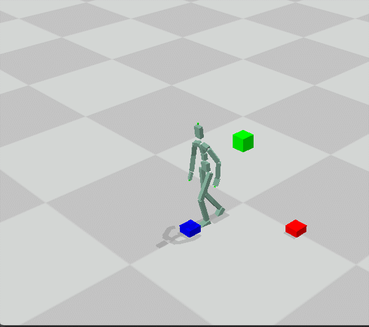
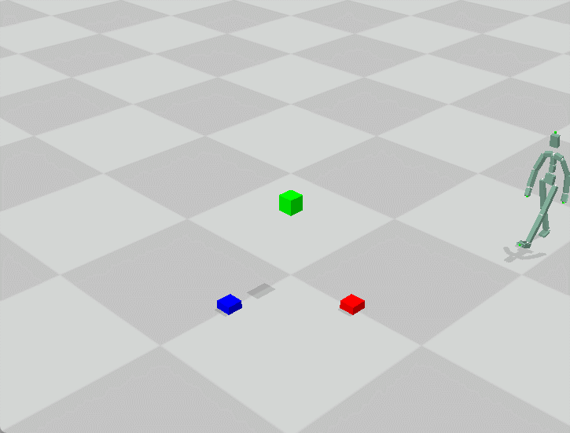
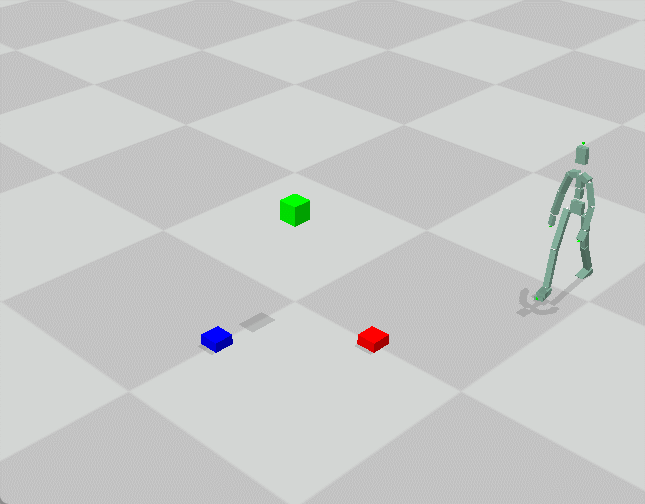

# 作业一报告

## 任务一
### Part 1
使用所给公式计算得到混合后的帧数。
$$
n_3 = \frac{w_1 * v_1 * n_1+w_2 * v_2 * n_2}{v}
$$

其中$w$为混合权重

$$
w_1 = \frac{v_2-v}{v_2-v_1}
$$

$$
w_2 = 1.0 - w_1
$$

并将$\alpha$设置为$w_1$

最后根据$\alpha$加权混合各个关节的位置以及选择即可。旋转的插值使用`scipy`库的`Slerp`实现。

最终效果如下：

### Part 2
计算第一帧与最后一帧的根关节位置差距以及速度差距作为临界阻尼弹簧的初始位置和初始速度。（根关节的速度可以用相邻两帧的位置差除以相隔时间近似）。再使用`smooth_utils.py`中提供的`decay_spring_implicit_damping_pos`函数计算出临界阻尼弹簧在每个时刻的位置。将得到的位置与原根关节的位置相加，得到平滑的效果。

对于其他关节的旋转，同理可以使用`decay_spring_implicit_damping_rot`函数，根据旋转的差距以及角速度的变化，计算出临界阻尼弹簧在每个时刻的旋转，并将其与原来的旋转相乘，达到平滑。

此外，在动作的开始和结束都使用该方法进行平滑，使用`ratio`参数加权，避免有部分帧变化过大。

最终效果如下：

### Part 3
首先，计算得出`motion1`第`mix_frame1`帧根节点的`facing_axis`和位置，将`motion2`的第一帧根节点与之对齐。

接着，模仿Part 2的做法，使用阻尼弹簧系统，将`motion2`的第一帧与`motion1`的第`mix_frame1`帧进行平滑，使动作衔接自然，没有跳变。

最后，取出Part 1的前`mix_frame1`帧，并与`motion2`拼接即可。

最终效果如下：

### 任务二

实现一个简单的交互，只有在播放完一个动作之后，才会响应输入。仅根据目标朝向选择动作。如果目标旋转与当前旋转差距在45度以内，则直走，向右45度与135度之间，则右转，向右135度以上，则向右后方转。左转与左后方转同理。

更新角色的位置和朝向的方法与Part 3类似，通过对齐`facing axis`和`pos`实现。

插值方法直接调用Part 3的`concatenate_two_motions`函数即可，注意这里由于只能调整目标动作，所以将`concatenate_two_motions`的`ratio`参数设置为1，表示只修改拼接的动作完成平滑。

最终效果如下：

