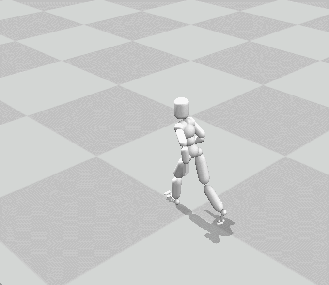
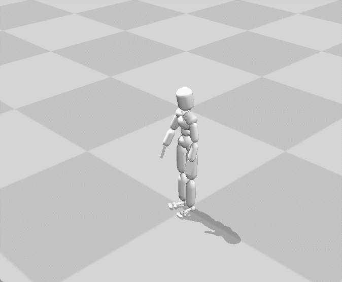

# 作业一报告

## 任务一
### Part 1
使用公式计算每个关节上应当添加的力矩。
$$
    \tau=k_{p}({\bar{q}}-q)-k_{d}\dot{q}
$$
，其中$\bar{q}$为目标orientaion，$q$为当前orientation

在实际实现时，先将当前orientation与目标orientation转到父关节的坐标系下，再将算好的力矩$\tau$转换到世界坐标系下。

最终效果如下（注意由于电脑性能的原因，仿真速度无法跟上渲染速度，因此看上去运动较慢）：

### Part 2
根关节上所增加的力矩即为Part 1中所忽略掉根关节力矩。

根关节上所增加的力也使用pd control，即
$$
    f=k_{p}({\bar{x}}-x)-k_{d}\dot{x}
$$

最终效果如下：

### Part 3
使用Jacobian Transpose control方法，在Part 1计算的力矩基础上，在下半身增加一些力矩以保持平衡。

需要增加在重心的virtual force可以通过公式$f=k_p(\bar{c}-c)-k_d\dot{c}$得到。

在每个关节需要增加的力矩为$\tau_i=(x-p_i)\times f$.

最终效果如下：

