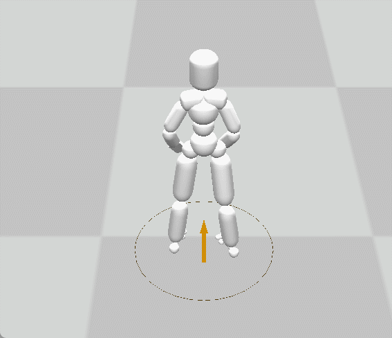

# 大作业报告(Motion Matching)

## 实现方法
### 实现思路
每隔若干帧进行一次搜索，根据目标状态、当前状态等参数，寻找动作库中最合适的动作，完成控制的及时响应。此外，切换动作时，使用Inertialized blending方法，将当前动作平滑地过渡到切换后的动作。

### 距离函数
为了选出动作库中最合适的动作，我们设计了以下标准，做到在响应控制信号的同时，最大程度保证动作序列的连贯性。注意，以下所有的代价计算都是在对齐根关节的位置和朝向后进行的。

**desire cost** 用于衡量该动作及其之后若干帧动作与目标根关节的速度、角速度、位置、朝向等参数的差异。该损失函数是实现响应输入控制信号的关键。其中速度和位置的差异能够很好的确定下一个动作是走路、跑步还是静止，而角速度和朝向的差异可以确定角色是否在发生转向。desire cost的表达式为
$$C_{desire} = \sum_{i \in \{0,20,40,60,80,100\}} w_{pos}||\tilde{x_i}-x_i||+w_{vel}||\tilde{v_i}-v_i||+w_{rot}||\tilde{R_i}-R_i||+w_{avel}||\tilde{\omega_i}-\omega_i||$$
其中$\tilde{x_i},\tilde{v_i},\tilde{R_i},\tilde{\omega_i}$表示第$i$帧后的目标位置，速度，朝向，和角速度。${x_i},{v_i},{R_i},{\omega_i}$表示衡量的动作之后的第$i$帧的位置，速度，朝向，和角速度。

**shift cost** 用于衡量该动作与当前动作的各个关节的速度、角速度、位置、朝向等参数的差异。（根关节除外）。shift cost能够使得动作的过渡较为平缓，减少跳变。需要注意的是，关节的速度和角速度也是重要特征， 反映了当前动作的相位。shift cost的表达式为

$$C_{shift} = \sum_{j \in joints} w_{pos}||\tilde{x_j}-x_j||+w_{vel}||\tilde{v_j}-v_j||+w_{rot}||\tilde{R_j}-R_j||+w_{avel}||\tilde{\omega_j}-\omega_j||$$

其中$\tilde{x_j},\tilde{v_j},\tilde{R_j},\tilde{\omega_j}$表示当前状态下关节$j$的位置，速度，朝向，和角速度。${x_j},{v_j},{R_j},{\omega_j}$表示衡量的动作的关节$j$的位置，速度，朝向，和角速度。

此外，在实现的过程中，我们发现变化幅度最大的关节往往会最大程度地影响切换的平滑度。因此，在实际计算$C_{shift}$时，我们使用max函数汇总所有关节的偏差信息，而不是将它们相加。

**velocity cost** 用于衡量该动作与当前动作根关节的速度和角速度的差异，保证角色运动时的速度不发生突变。velocity cost的表达式为

$$C_{velocity} = w_{vel}||\tilde{v}-v||+w_{avel}||\tilde{\omega}-\omega||$$

其中$\tilde{v},\tilde{\omega}$表示当前状态根关节速度角速度。$v,\omega$表示衡量的动作的根关节速度和角速度。

**最优帧选择策略** 在实验中，我们发现，将以上三个损失函数加权混合时，由于达到目标状态与保持平滑过渡直接存在冲突，容易出现动作跳变，或者不响应控制输入的问题。因此，我们采取以下策略：首先设定参数$\delta$，选取所有满足$C_{desire}<\delta$的帧，再在其中选取$C_{shift}+C_{velocity}$最小的帧。这样可以保证控制输入能够得到响应，并最大程度保证不发生跳变。

### Inertialized blending
我们使用`smooth_utils.py`里的`decay_spring_implicit_damping_pos`和`decay_spring_implicit_damping_rot`函数完成平滑过渡。具体而言，我们计算跳变后的帧与跳变前的帧之间的位置，速度，朝向，和角速度差距，使用Inertialized blending方法，更新跳变后的若干帧运动状态。（位置和角速度的差距都使用axis angle的表示方法）。

### 实现细节
具体而言，我们每隔15帧进行一次搜索，这样可以做到在1/4秒内响应控制输入，同时也有足够的时间用于平滑地将切换前的动作过渡到目标动作。此外，由于计算能力的限制，我们只使用了走路和跑步各5千帧动作作为搜索范围，并裁剪掉动作片段最开始的300帧T-pose动作序列，因为这一部分的动作与走路、跑步、停止、转向等控制无关。

## 代码使用说明
### 文件修改
在`task1_project`文件中，为`update_state`函数添加参数`current_gait`即可。即将原代码中的

    character_state = self.character_controller.update_state(
            desired_pos_list, desired_rot_list, 
            desired_vel_list, desired_avel_list
            )

改为

    character_state = self.character_controller.update_state(
            desired_pos_list, desired_rot_list, 
            desired_vel_list, desired_avel_list, current_gait
            )

### 操作方法
使用w,s,a,d键（或上下左右键）实现跑动。按照空格键的同时按住w,s,a,d键（或上下左右键）可实现走路。不按键时默认为静止不动。

## 实现效果
### 跑步与静止的切换
通过motion matching的方法，可以快速响应键盘输入，在任何时候开始或结束跑步动作，并能自然地与静止时的动作衔接。

### 跑步过程中转向的切换
跑步的方向发生改变时，由于跑步的动作库中包含转向动作，因此可以自然地挑选出转向动作，实现多种角度的旋转。

### 跑步与走路的切换
跑步过程中按空格键可以切换到走路动作。通过motion matching的方法，可以在跑步时的各种相位下寻找到最接近的走路动作，无需等到完成一个跑步周期后再进行切换。
